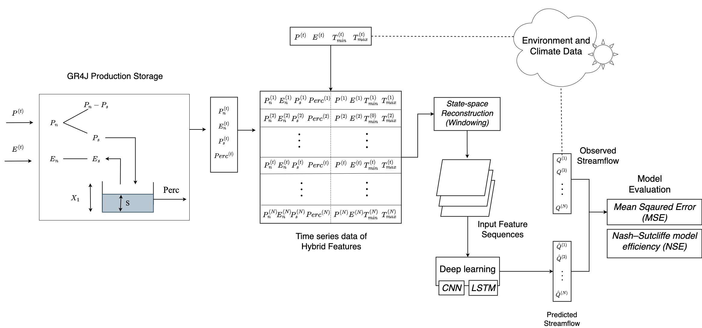

# DeepGR4J
We present synergy of Conceptual hydrological model GR4J and Convolutional Neural Network (CNN) and Long Short-term Memory (LSTM) neural networks for improved prediction performance in streamflow prediction tasks. 




## How to run?
Please refer to the `environment.yml` file for the Python requirements of this project.

- Step 1: Download the data
  This project uses the `camels-aus-py` library for downloading and managing the camels-aus dataset. Please refer to the steps here to download data into the `<Path to DeepGR4J Repo>/data/camels/aus`
- Step 2: Create train and test datasets
  ```
  $ cd scripts
  $ python create_datasets.py --data-dir ~/data/camels/aus --sub-dir no-scale-seq
  ```
- Step 3: Calibrate GR4J model
  ```console
  $ cd scripts
  $ python calibrate_gr4j.py --data-dir ../data/camels/aus --sub-dir no-scale-seq --run-dir ../results/gr4j
  ```
- Step 4: Train DeepGR4J LSTM model
  ```console
  $ cd scripts
  $ python train_hybrid_gr4j_cnn.py --data-dir ../data/camels/aus --sub-dir no-scale-seq --run-dir ../results/deepgr4j_cnn_qin --gr4j-run-dir ../results/gr4j --dropout 0.1 --lr 0.001 --n-filters 8 8 6 --window-size 7 --q-in
  ```
